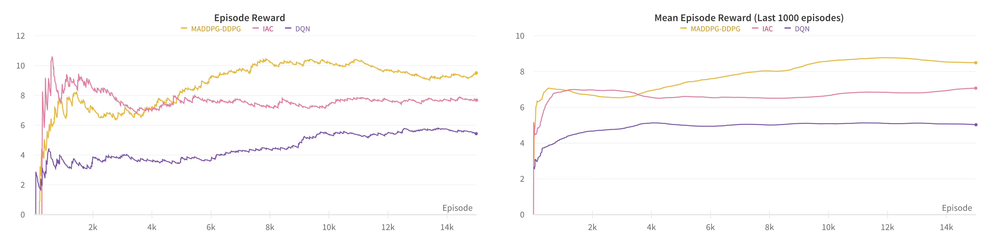

# Predator-Prey-MARL
PyTorch Implementation of MADDPG and DDPG in a Multi-Agents Predator-Prey(MAPP) environment.

### Install Python Environment

Install Python environment with conda:

```bash
conda create -n pp_env python=3.10 -y
conda activate pp_env
pip install -r requirements.txt
```

### How to Train the Agents

Execute the following command to train the agents:

MADDPG for Predators and DDPG for Prey

```bash
wandb login
python training_MADDPG.py
```

Provide your wandb API key when prompted. (Get one from https://wandb.com)

### Results

|  environment name   | training result                         |
|  ----  |------------------------------------------------------|
| MAPP  |  |


### References

- [PettingZoo-MPE](https://github.com/Farama-Foundation/PettingZoo)
- [MADDPG](http://arxiv.org/abs/1706.02275)
- [DDPG](http://arxiv.org/abs/1509.02971)