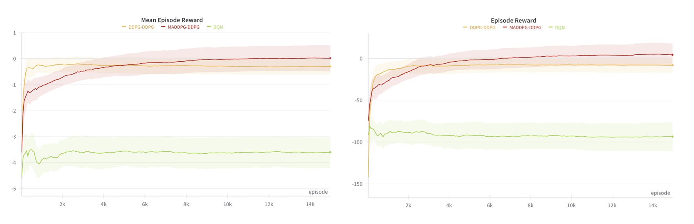
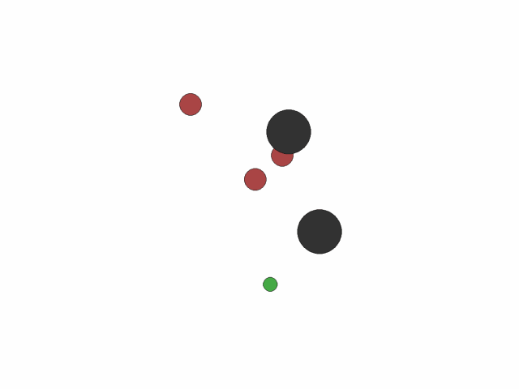
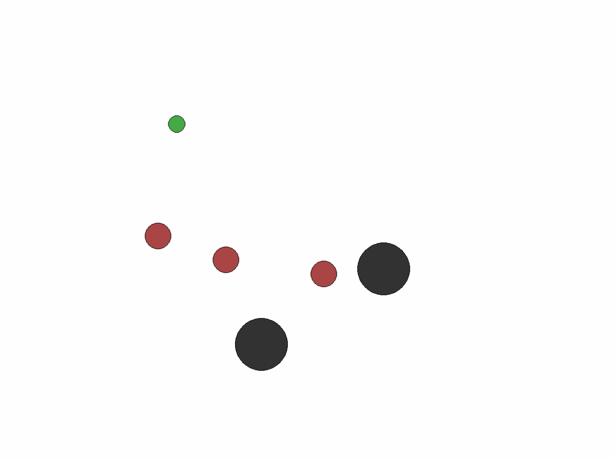

# Predator-Prey-MARL
PyTorch Implementation of MADDPG and DDPG in a Multi-Agent Predator-Prey(MAPP) environment.

### Install Python Environment

Install Python environment with conda:

```bash
conda create -n pp_env python=3.10 -y
conda activate pp_env
pip install -r requirements.txt
```

### How to Train Agents

Execute the following command to train the agents: (MADDPG for Predators and DDPG for Prey)

```bash
wandb login
python training_MADDPG.py
```

Provide your wandb API key when prompted. (Get one from https://wandb.com)

Our full-trained MADDPG models are saved in the `./MADDPG_DDPG_models` directory.

### How to Evaluate the Performances of Agents

Execute the following command to evaluate the performances of agents:

```bash
python evaluation.py
```
The gifs of MADDPG models in the evaluation will be saved in the `./MADDPG_gifs` directory.

### Results

| Environment Name | Training Results                                       |
|------------------|--------------------------------------------------------|
| MAPP        |     |

| Training Algorithm | Evaluation Results                                   |
|------------------|--------------------------------------------------------|
| DDPG-DDPG        |     |
| MADDPG-DDPG      |   |


### References

- [PettingZoo-MPE](https://github.com/Farama-Foundation/PettingZoo)
- [MADDPG](http://arxiv.org/abs/1706.02275)
- [DDPG](http://arxiv.org/abs/1509.02971)
- [MPE](https://github.com/shariqiqbal2810/multiagent-particle-envs)
- [OpenAI-MPE](https://github.com/openai/multiagent-particle-envs)
- [OpenAI-MADDPG](https://github.com/openai/maddpg)
- https://github.com/shariqiqbal2810/maddpg-pytorch
